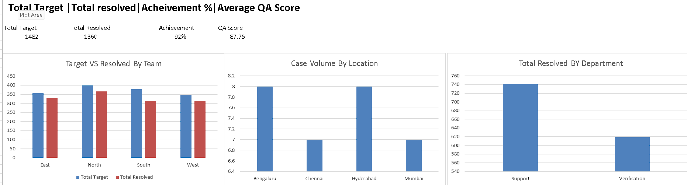
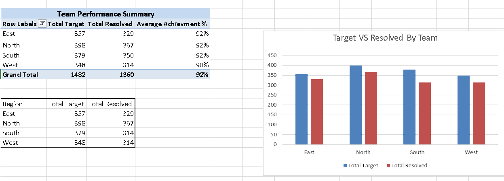
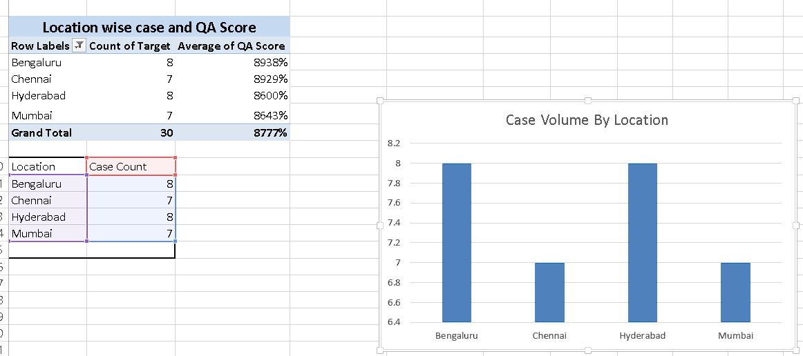
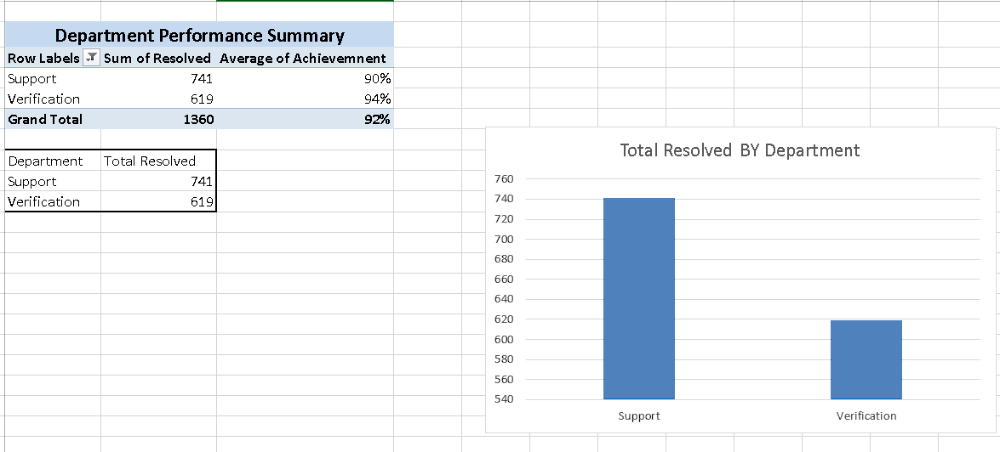
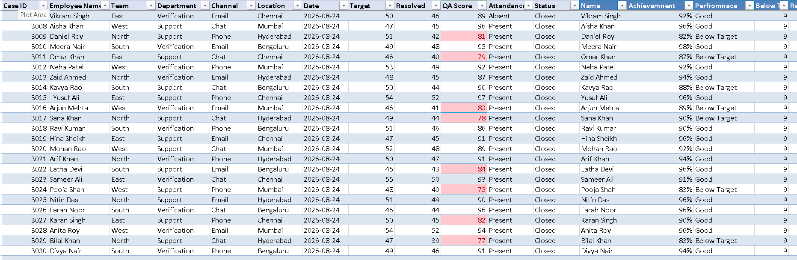

# Excel MIS Performance Reporting Dashboard

## Project Overview

This project demonstrates an MIS reporting workflow built in Microsoft Excel. The report analyzes employee and team performance using operational targets, resolved cases, achievement percentage, QA scores, departments, locations, and communication channels.

The project includes structured raw data, PivotTable-based analysis, KPI reporting, and a management dashboard for quick performance monitoring.

## Tools & Skills Used

- Microsoft Excel
- PivotTables
- PivotCharts
- SUM and AVERAGE functions
- Lookup functions
- Percentage calculations
- Conditional Formatting
- Data Cleaning & Validation
- KPI Reporting
- MIS Reporting
- Dashboard Design

## Key KPIs

- Total Target: 1,482
- Total Resolved: 1,360
- Overall Achievement: 91.8%
- Average QA Score: 87.75

## Dashboard Features

- Team-wise Target vs Resolved analysis
- Location-wise Case Volume analysis
- Location-wise Average QA Score
- Department-wise Resolution performance
- Average Achievement % analysis
- KPI summary dashboard
- Conditional formatting for performance monitoring

## MIS Dashboard

## Team Performance

Team-wise analysis of Total Target, Total Resolved and Average Achievement %.

## Location QA Summary

Location-wise analysis of case volume and Average QA Score.

## Department Performance

Department-wise analysis of Total Resolved and Average Achievement %.

## Raw Data

The project uses structured operational data containing employee, team, department, channel, location, target, resolved cases, QA score, attendance and status information.

## Key Insights

- Overall achievement is approximately 91.8%, with 1,360 resolved cases against a target of 1,482.
- East, North and South teams achieved approximately 92%, while West recorded approximately 90%.
- QA performance can be compared across locations to identify differences in service quality.
- Department-level reporting provides visibility into resolution workload across Support and Verification teams.

## Project Files

- `MIS_Performance_Report.xlsx` — Complete Excel MIS report and dashboard
- `MIS_Dashboard.png` — Dashboard preview
- `Team_Performance.png` — Team performance analysis
- `Location_QA_Summary.png` — Location and QA analysis
- `Department_Performance.png` — Department performance analysis
- `Raw_Data.png` — Dataset preview

## Author

**Yousuf Khan**

Data Analytics | Power BI | SQL | Excel | MIS Reporting
